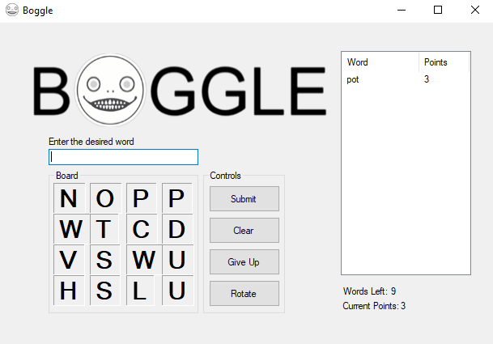

# Boogle

The present school project consists of a Boogle game with two modes. The first mode is a 3x3 board and the second with a 4x4. Boogle is a 
game where the objective is to create words made up from adjoining letters in the board– the letters must touch each other – 
and must be able to connect to each other in the proper sequence to spell the word correctly. The letters may join in any direction
– horizontally, vertically, or diagonally. 

The player is supposed to type the word in the blank text and submit it once he believes he found a word. The give up buttom shows
all the words that were made in that certain board (the number of words found in the board are also shown below the list of
found words). The rotate buttom just gives you another board, it simulates the real life boogle when you press and mix the dices up

This project shows how important it is to choose the right algorithm for the job. The first mode (3x3) has a complexity of 
O(n^2). It goes "node" by "node" in order to check all the possibilities. Even after some smart optimization, it just takes
too long to finish loading all the words. In the second mode (4x4), however, a trie tree was used and it made the lookup for
words way faster. Even if the board is significantly bigger, it does a fantastic job with it, a job that the first board would
not be able to do since it would take too long to actually finish.

